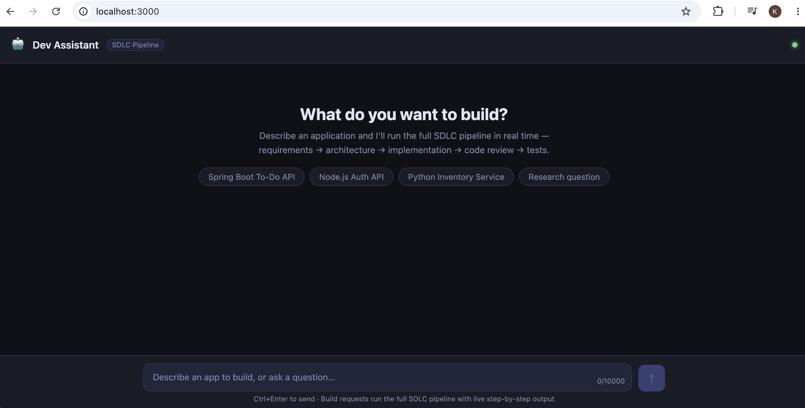
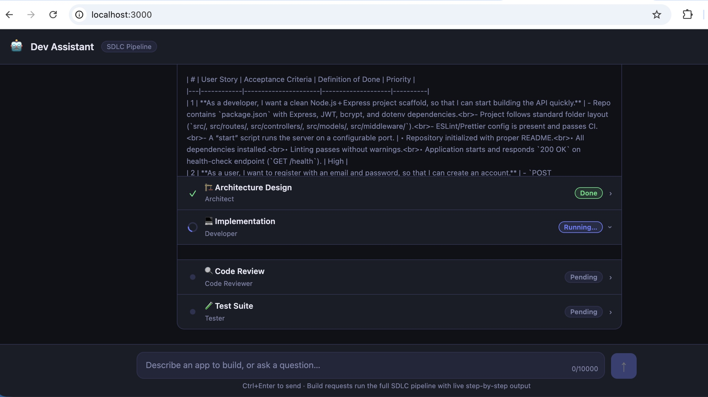

# Research Assistant

A lightweight TypeScript service that integrates with an LLM (Ollama) and a vector database.  
It demonstrates solid configuration handling, error safety, and a clear public API surface.

## 📦 Project Setup

| Step | Command |
|------|---------|
| **1️⃣ Install dependencies** | `npm ci` (or `npm install` if `package-lock.json` is missing) |
| **2️⃣ Build the sources** | `npm run build` – compiles `src/**/*.ts` → `dist/` |
| **3️⃣ Run the app** | `npm start` – launches the compiled server (`dist/server.js`) |
| **4️⃣ Run in development** | `npm run dev` – uses `tsx` for on‑the‑fly compilation with hot‑reload |
| **5️⃣ Lint / type‑check** | `npm run lint` & `npm run typecheck` |
| **6️⃣ Test** | `npm test` – runs Jest unit tests |

### Required Environment Variables

The configuration loader validates the variables described below (see `src/config/schemas.ts` for the source of truth). Provide them via a **`.env`** file at the project root, the host environment, or a **`config.json`** file.

| Variable | Description | Example |
|----------|-------------|---------|
| `NODE_ENV` | Execution mode (`development`, `production`, …) | `development` |
| `PORT` | HTTP port (defaults to `3000`) | `8080` |
| `OLLAMA_BASE_URL` | Ollama server URL (defaults to `http://localhost:11434`) | `https://my-ollama.cloud` |
| `OLLAMA_MODEL` | Model to use – defaults to `llama3.2` | `mistral` |
| `VECTOR_DB_URL` | URL of the vector DB service | `https://example.pinecone.io` |
| `LOG_LEVEL` | Minimum log level (`error`, `warn`, `info`, `debug`) | `info` |
| `ENABLE_EXPERIMENTAL` | Feature‑toggle (`true`/`false`) | `true` |
| `DB_HOST` | PostgreSQL host | `localhost` |
| `DB_PORT` | PostgreSQL port (default `5432`) | `5432` |
| `DB_USER` | PostgreSQL user | `postgres` |
| `DB_PASSWORD` | PostgreSQL password (secret) | `secret` |
| `DB_NAME` | PostgreSQL database name | `research_assistant` |

> **⚠️ Security note** – Never commit real secrets. Keep a clean `.env.example` template and add `.env` to `.gitignore`.

## � Environment Configuration & Application Startup

### Prerequisites

Before running the application, ensure you have:

- **Node.js** (v18 or higher) – [Download](https://nodejs.org/)
- **npm** (v9 or higher) – Comes with Node.js
- **PostgreSQL** (v12 or higher) – [Download](https://www.postgresql.org/download/) or use Docker
- **Ollama** – [Download](https://ollama.ai/) for local LLM or configure a remote URL
- **Qdrant Vector DB** (optional) – [Download](https://qdrant.tech/) or use cloud service

### Step 1️⃣: Clone & Install Dependencies

```bash
# Clone the repository
git clone <repository-url>
cd multi_agent_software_development_application

# Install dependencies
npm ci
```

### Step 2️⃣: Configure Environment Variables

**Option A: Using `.env` file (Recommended)**

```bash
# Copy the example file
cp .env.example .env

# Edit .env with your settings
nano .env
```

**Option B: Using environment variables directly**

```bash
export NODE_ENV=development
export PORT=3000
export OLLAMA_BASE_URL=http://localhost:11434
export OLLAMA_MODEL=llama3.2
export VECTOR_DB_URL=http://localhost:6333
export LOG_LEVEL=info
export DB_HOST=localhost
export DB_USER=postgres
export DB_PASSWORD=postgres
export DB_NAME=research_assistant
```

### Step 3️⃣: Set Up Backend Services

#### PostgreSQL Database

```bash
# Using Docker (recommended)
docker run --name postgres-research \
  -e POSTGRES_USER=postgres \
  -e POSTGRES_PASSWORD=postgres \
  -e POSTGRES_DB=research_assistant \
  -p 5432:5432 \
  -d postgres:15-alpine

# Or use local installation
createdb -U postgres research_assistant
```

#### Qdrant Vector Database

```bash
# Using Docker
docker run --name qdrant \
  -p 6333:6333 \
  -d qdrant/qdrant

# Or download and run locally from https://qdrant.tech/
```

#### Ollama LLM Server (Local)

```bash
# Download and start Ollama
# https://ollama.ai

# Pull a model
ollama pull llama3.2

# Start Ollama server (runs on http://localhost:11434)
ollama serve
```

### Step 4️⃣: Run the Application

#### 🔧 Development Mode (Hot Reload)

```bash
npm run dev
```

- **Features**: Auto-recompilation, live reload, detailed logging
- **Output**: Server running on `http://localhost:3000`
- **Logs**: Real-time debug output in terminal

#### ⚡ Production Mode

```bash
# Build the TypeScript
npm run build

# Start the server
npm start
```

- **Features**: Optimized build, minimal bundle size
- **Output**: Server running on configured `PORT` (default `3000`)

#### 🧪 Run Tests

```bash
# Run all tests
npm test

# Run tests in watch mode
npm test -- --watch

# Run specific test file
npm test -- src/tests/example.test.ts
```

#### 📝 Code Quality

```bash
# Type-check (no compilation)
npm run typecheck

# Lint code
npm run lint
```

### Step 5️⃣: Verify the Application

Once running, test the application:

```bash
# Check health endpoint
curl http://localhost:3000/health

# Test research endpoint
curl -X POST http://localhost:3000/api/research \
  -H "Content-Type: application/json" \
  -d '{"query": "What is TypeScript?"}'
```

### Troubleshooting

| Issue | Solution |
|-------|----------|
| **Port already in use** | Change `PORT` in `.env` or kill the process on that port |
| **Database connection failed** | Verify PostgreSQL is running and `DB_*` variables are correct |
| **Ollama connection error** | Ensure Ollama is running (`ollama serve`) and `OLLAMA_BASE_URL` is correct |
| **Vector DB connection failed** | Check Qdrant is running on the configured `VECTOR_DB_URL` |
| **Module not found** | Run `npm ci` to reinstall dependencies |

## 🛠️ Architecture Overview

The application is a **multi-agent software development assistant** built on Express.js. It exposes a chat interface that can either answer research questions via an LLM or trigger a full **Software Development Lifecycle (SDLC) pipeline** driven by a team of specialised AI agents.

---

### High-Level Structure

```
src/
├── server.ts          # HTTP server bootstrap (binds port)
├── app.ts             # Express app factory + middleware + route wiring
├── index.ts           # Package entry point / public exports
├── logger.ts          # Winston logger (respects LOG_LEVEL)
│
├── config/
│   ├── config.ts      # Loads & validates environment variables
│   ├── schemas.ts     # Zod schemas (source of truth for all config)
│   └── errors.ts      # Typed application error classes
│
├── routes/
│   ├── chat.ts        # POST /api/chat  – SSE-streamed unified endpoint
│   ├── sdlc.ts        # POST /api/sdlc  – direct pipeline trigger
│   └── research.ts    # POST /api/research – single Ollama query
│
└── agents/
    ├── base.ts         # BaseAgent – shared Ollama fetch + streaming
    ├── orchestrator.ts # SdlcOrchestrator – runs the 5-stage pipeline
    ├── productOwner.ts # Stage 1 – requirements → user stories
    ├── architect.ts    # Stage 2 – user stories → technical design
    ├── developer.ts    # Stage 3 – design → implementation code
    ├── reviewer.ts     # Stage 4 – code → review report
    ├── tester.ts       # Stage 5 – artefacts → test suite
    └── fileWriter.ts   # Parses code blocks & writes files to disk

public/                # Static frontend (served at /)
generated/             # Output directory for agent-generated projects
```

---

### Request Flow

#### Plain Chat / Research
```
Client → POST /api/chat
           │
           ├─ isBuildIntent() → false
           │
           └─ Ollama API (/api/chat)
                └─ SSE: event: message → Client
```

#### SDLC Pipeline (Build Intent Detected)
```
Client → POST /api/chat  (or POST /api/sdlc)
           │
           ├─ isBuildIntent() → true
           │
           └─ SdlcOrchestrator.run()
                │
                ├─ Stage 1 – ProductOwnerAgent   → user stories + acceptance criteria
                ├─ Stage 2 – ArchitectAgent       → component design, data models, API spec
                ├─ Stage 3 – DeveloperAgent       → implementation code  ──► written to disk
                ├─ Stage 4 – ReviewerAgent        → code review report
                └─ Stage 5 – TesterAgent          → test suite            ──► written to disk
                                │
                                └─ SSE: event: progress (per stage) → Client
                                   SSE: event: done (projectDir + files) → Client
```

Each stage streams tokens back to the client as `progress` Server-Sent Events while simultaneously accumulating the full output to pass as context to the next agent.

---

### Agent Pipeline Detail

| Step | Agent | Input | Output |
|------|-------|-------|--------|
| 1 | **Product Owner** | Raw requirements text | User stories + acceptance criteria (Markdown) |
| 2 | **Architect** | User stories | Technical design: components, data models, API endpoints, risks |
| 3 | **Developer** | User stories + design | Production source code (language/framework from design) |
| 4 | **Code Reviewer** | All previous artefacts | Review report: bugs, security issues, best-practice gaps |
| 5 | **Tester** | All previous artefacts | Full test suite (JUnit / Jest / pytest etc.) |

All agents extend `BaseAgent`, which handles Ollama communication (both streaming and non-streaming modes) and injects `Authorization` headers when `OLLAMA_API_KEY` is set.

---

### Key Design Decisions

| Decision | Rationale |
|----------|-----------|
| **SSE over WebSockets** | Simpler one-way streaming from server → client; no extra WS server needed |
| **Sequential pipeline** | Each agent's output is the next agent's context — ordering is intentional |
| **LLM-agnostic via Ollama** | Any model served by Ollama (local or remote) works without code changes |
| **Zod config validation** | Fails fast at startup with clear error messages if required env vars are missing |
| **`generated/` output dir** | Keeps agent-created projects isolated from the service's own source tree |
| **`isBuildIntent()` heuristic** | Single endpoint handles both chat and build requests; no explicit mode switch needed |

---

### API Endpoints

| Method | Path | Description |
|--------|------|-------------|
| `GET` | `/` | Serves the static frontend (`public/index.html`) |
| `GET` | `/healthz` | Health check – returns `{ status: "ok" }` |
| `POST` | `/api/chat` | Unified SSE endpoint: chat or full SDLC pipeline |
| `POST` | `/api/sdlc` | Directly trigger the SDLC pipeline (JSON response) |
| `GET` | `/api/sdlc/agents` | List all pipeline agents and their roles |
| `POST` | `/api/research` | Single-shot research query via Ollama |

---

## 📸 Screenshots

### Home Screen


### SDLC Pipeline in Action

